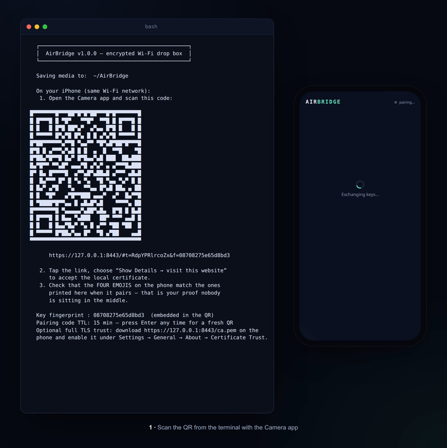

# AirBridge 📱⇄🐧

[](#verification)
[](LICENSE)


[](https://github.com/AseemLab/AirBridge/releases/latest)

End-to-end encrypted photo & video transfer from an iPhone to a Linux machine over your local Wi-Fi. No cloud, no cables, no app to install on the phone — Safari and a QR code are enough. Every byte is AES-256-GCM encrypted **on the phone** before it leaves the device.



```
┌────────────┐   scan QR    ┌──────────────────────────┐
│   iPhone   │ ───────────▶ │  Safari page (WebCrypto) │
│  (Safari)  │              │  encrypts each 4 MiB     │
└────────────┘              │  chunk with AES-256-GCM  │
                            └────────────┬─────────────┘
                                         │ TLS + E2E ciphertext
                                         ▼
                            ┌──────────────────────────┐
                            │  server.py on Linux      │
                            │  authenticates, decrypts │
                            │  → ~/AirBridge/          │
                            └──────────────────────────┘
```

## Install

**No terminal, no Python, no dependencies to think about — download a package:**

| Your Linux | Do this |
|---|---|
| Ubuntu, Debian, Mint, Pop!_OS, elementary | Download the **`.deb`** from [Releases](https://github.com/AseemLab/AirBridge/releases/latest) → double-click it → click **Install**. Then open **AirBridge** from your applications menu. |
| Fedora, Arch, openSUSE, or anything else | Download the **AppImage** from [Releases](https://github.com/AseemLab/AirBridge/releases/latest) → right-click it → **Properties → Permissions → Allow executing file as program** → double-click it. |

Either way, a terminal window opens with a QR code — scan it with the iPhone's Camera app and follow the on-screen steps (see *Quick start* below for what happens next). The AppImage is fully self-contained (its own Python, no system packages touched); the `.deb` installs a small `airbridge` command plus an app-menu entry via `apt`/your software center.

## Quick start (from source)

```bash
./run.sh
```

That's it — the script creates a local virtual environment on first run, installs `cryptography` and `qrcode` into it, and starts the server. Any flags are forwarded, e.g. `./run.sh --port 9000 --out ~/Pictures/Incoming`.

<details>
<summary>Prefer to do it by hand?</summary>

```bash
python3 -m venv .venv
source .venv/bin/activate
pip install -r requirements.txt
python3 server.py
```
</details>

Then, on the iPhone (connected to the **same Wi-Fi**):

1. Scan the QR code shown in the terminal with the Camera app.
2. Safari warns about the local certificate — tap **Show Details → visit this website**. (Or skip the warning forever: see *Full TLS trust* below.)
3. Four emojis appear on the phone **and** in your terminal. If they match, the channel is authentic. If they don't, someone is intercepting — close the page.
4. Tap **Choose photos & videos** and select anything from your library. Files land in `~/AirBridge/` (change with `--out`).

Useful flags: `--out DIR`, `--port 8443`, `--max-gb 25`, `--token-ttl 900`, `--ip X.X.X.X` (address to advertise if auto-detection picks the wrong interface). Press **Enter** in the terminal at any time to mint a fresh QR/pairing code.

If a firewall is active, open the port once: `sudo ufw allow 8443/tcp`.

## Security architecture

**Layer 1 — Transport (TLS 1.2+).** On first run AirBridge creates a private certificate authority in `~/.local/share/airbridge/` and issues itself a server certificate covering your machine's LAN IPs. Keys are stored `0600` and never leave your machine.

**Layer 2 — End-to-end encryption, independent of TLS.**

- *Key agreement:* ephemeral ECDH on NIST P-256, a fresh server keypair per launch and a fresh browser keypair per page load (forward secrecy).
- *Server authentication that defeats man-in-the-middle:* the SHA-256 fingerprint of the server's pairing key rides inside the QR code's **URL fragment**. Fragments are never transmitted over the network — the phone receives the fingerprint by literally looking at your screen, an out-of-band channel an on-network attacker cannot touch. The page refuses to pair if the responding key doesn't hash to that fingerprint.
- *Key derivation:* HKDF-SHA256 over the ECDH secret, salted per session, with both public-key hashes bound into the `info` string.
- *Bulk encryption:* AES-256-GCM per 4 MiB chunk with random 96-bit nonces. Each chunk's additional authenticated data binds `session | file | chunk index | total chunks`, so ciphertext cannot be tampered with, reordered, replayed, spliced between files, or truncated without detection. Files ≤ 64 MB additionally carry a whole-file SHA-256 the server verifies before saving.
- *Human verification:* both ends derive a 4-emoji Short Authentication String (plus a hex code) from the session key — a two-second visual check that the phone and the terminal share the same secret.

**Layer 3 — Hygiene.** One-time pairing tokens with a 15-minute TTL and constant-time comparison; per-IP pairing rate limits; session and per-file caps; strict body-size enforcement per chunk; filename sandboxing (traversal-proof, control-characters stripped, collisions de-duplicated instead of overwritten); partial files quarantined in `.airbridge-parts/` until fully verified; CSP/nosniff/frame-deny headers on the web app; the server never logs the token (it lives in the URL fragment, which browsers don't send).

### Threat model, honestly

| Attacker | Outcome |
|---|---|
| Passive sniffing on the Wi-Fi (most common) | Sees only TLS-wrapped AES-GCM ciphertext. Nothing recoverable. |
| Active MITM presenting its own key | Fingerprint check from the QR fragment fails → phone refuses; emojis won't match. |
| Tampering with / reordering / replaying chunks in flight | GCM tag + AAD binding → rejected, and the terminal prints a security warning. |
| Stealing the QR token (e.g., shoulder-surfing) | Can pair, but every pairing is announced loudly in the terminal with its own emoji code; tokens expire; press Enter to rotate. |
| Full real-time MITM that also rewrites the page's JavaScript | The one theoretical hole of any browser-delivered crypto with an untrusted cert. Closed completely by installing the CA (below) — then TLS itself is fully validated. |

### Full TLS trust on the iPhone (optional, recommended)

Open `https://<your-ip>:8443/ca.pem` on the phone once, then: **Settings → Profile Downloaded → Install**, and enable it under **Settings → General → About → Certificate Trust Settings**. From then on there is no certificate warning and even a JavaScript-rewriting MITM is impossible. You can delete the profile any time.

## Verification

Two test suites are included and were run against a live TLS instance:

- `python3 test_e2e.py` — 25 checks: CA-validated TLS, full pairing + upload from an independent Python client, **and the exact shipped browser JavaScript executed under Node's WebCrypto** (bit-for-bit file comparison, matching emoji SAS on both ends), plus adversarial cases: wrong tokens, forged fingerprints, tampered ciphertext, replayed and cross-spliced chunks, wrong-purpose envelopes, incomplete finishes, bad whole-file hashes, path traversal.
- `python3 test_stress.py` — three devices uploading concurrently (78 MB incl. a 64 MB video, parallel out-of-order chunk lanes): all bit-for-bit, no stray partial files.

## Notes & FAQ

- **HEIC / HEVC:** files transfer exactly as Safari provides them. iOS sometimes converts HEIC→JPEG when "Most Compatible" is set in *Settings → Camera → Formats*.
- **Speed:** crypto measures ~50 MB/s+ on modest hardware, so real transfers are limited by your Wi-Fi, not the encryption.
- **Multiple phones:** each pairing is an independent session with its own keys and emoji code.
- **Keep the tab open** while sending; the page holds a screen wake-lock during transfers and warns before closing mid-transfer.
- **Linux → iPhone?** This tool is one-directional by design (receive-only server = smaller attack surface). Files that arrive are yours to share back by any means.

## Repository layout

```
server.py        the whole application — HTTPS server, crypto, and the
                 embedded browser client (HTML/JS) it serves to the phone
run.sh           zero-setup launcher (creates .venv, installs deps, runs)
test_e2e.py      25-check suite: TLS, protocol interop, adversarial cases,
                 and the shipped browser JS executed under Node WebCrypto
test_stress.py   concurrent multi-device upload stress test
requirements.txt cryptography + qrcode, nothing else
packaging/       recipes for the .deb and AppImage published on Releases
```

## Contributing

PRs welcome — see [CONTRIBUTING.md](CONTRIBUTING.md) for dev setup, the
protocol invariants that Python and JS must keep in lockstep, and ideas for
first contributions. Security issues go through private disclosure instead:
see [SECURITY.md](SECURITY.md).

## License

[MIT](LICENSE) — do what you like; attribution appreciated.
